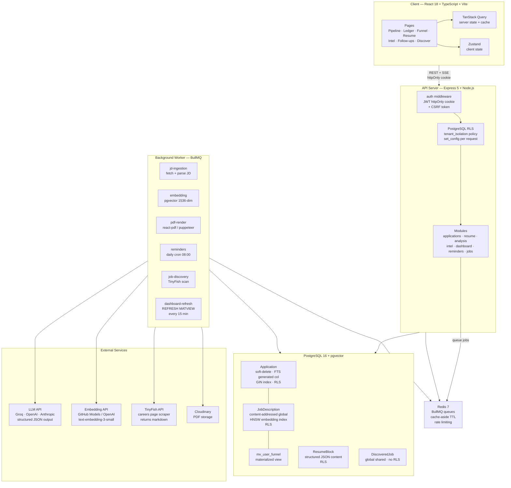

# Ascend

A full-stack job-hunt command center for software engineers. Tracks applications through the full pipeline, runs AI gap analysis and resume tailoring against each job description, discovers new openings from 130+ companies nightly, and surfaces intelligence across your entire application history.

---

## Architecture



---

## How It Works

### Application Pipeline
Add a job by URL or paste raw JD text. The ingestion worker fetches the page, parses it into structured fields (title, company, skills, YOE, salary) via LLM, and generates a 1536-dim embedding for similarity search. Applications move through a kanban pipeline (SAVED → APPLIED → OA → TECH → HR → OFFER) with every stage transition logged to `StageEvent`.

### AI Analysis
Three on-demand analyses per application, streamed over SSE:

| Analysis | What it does |
|----------|-------------|
| **Gap** | Scores resume against JD. Returns matched, missing, and partial skills + a 0–100 fit score |
| **Prep** | Generates technical, behavioral, and gap-probe interview questions tailored to the specific role |
| **Tailor** | Rewrites resume bullets to mirror JD language while keeping all facts truthful |

### Job Discovery
A background scan fetches careers pages from 130+ companies via TinyFish (returns clean markdown), extracts job links, and stores raw descriptions globally. Jobs are shared across all users — one fetch serves everyone. Each user independently clicks "Score for Relevance" to run LLM scoring (0–100 + reason) against their own resume blocks.

### Intelligence
Once you have 5+ applications with parsed JDs, the Intel page shows:
- **Skill demand** — which skills appear most across your JDs
- **Gap frequency** — skills most often missing from your resume
- **Job clusters** — k-means-style grouping of JDs by embedding similarity
- **Similar jobs** — HNSW approximate nearest-neighbor search per JD

### Dashboard
Funnel conversion rates, weekly application velocity, and LLM cost tracking. Stage counts read from a materialized view (`mv_user_funnel`) refreshed every 15 minutes. Dashboard responses are Redis-cached with 15-minute TTL, write-invalidated on any application create/update.

---

## Data Architecture

### Multi-Tenancy
Shared-schema multi-tenancy with PostgreSQL Row Level Security as a defense-in-depth layer. Every user-scoped table has a `tenant_isolation` policy:

```sql
CREATE POLICY tenant_isolation ON "Application"
  USING ("userId" = current_setting('app.current_user_id', true));
```

The `requireAuth` middleware sets this config var per request after JWT verification. Even if application code forgets a `WHERE userId` clause, the database refuses to return another tenant's rows.

### Content-Addressed Job Descriptions
`JobDescription` has no `userId`. The `jdHash` (SHA-256 of normalized raw text) is the global unique key. Two users applying to the same job share one row, one LLM parse call, and one embedding computation. Cost scales with unique job postings, not `users × jobs`.

### Index Strategy

| Index | Type | Why |
|-------|------|-----|
| `Application.search_vector` | GIN | FTS via stored generated tsvector column. O(log n) vs O(n) sequential scan |
| `JobDescription.embedding` | HNSW | Approximate KNN in O(log n). Dynamic inserts without rebuild vs IVFFlat |
| `Application(userId, createdAt)` | B-tree | Covers cursor pagination and velocity chart |
| `StageEvent(applicationId, at)` | B-tree | Dashboard median-days-in-stage scan |
| `Application(userId, createdAt) WHERE stage NOT IN (...)` | Partial | Active-only pipeline view. ~20% the size of a full index |
| `Reminder(applicationId) WHERE dismissedAt IS NULL` | Partial | Only indexes actionable reminders; dismissed rows never queried again |

### Soft Deletes
Applications use `deletedAt` (null = active). Enables undo, GDPR export-then-delete flow, and an audit trail. All queries filter `WHERE deletedAt IS NULL`.

---

## Tech Stack

| Layer | Technology |
|-------|-----------|
| Frontend | React 19, TypeScript, Vite 8, Tailwind CSS 3 |
| State | TanStack Query (server), Zustand (client) |
| Routing | React Router v7 |
| Drag & drop | dnd-kit |
| Charts | Recharts |
| API | Express 5, Node.js, Zod |
| ORM | Prisma 7 |
| Database | PostgreSQL 16 + pgvector |
| Queue | BullMQ 5 + Redis 7 |
| LLM | OpenAI-compatible (Groq / Anthropic / OpenAI) |
| Embeddings | GitHub Models / OpenAI text-embedding-3-small |
| Job scraping | TinyFish API |
| PDF | @react-pdf/renderer + Cloudinary |
| Auth | JWT (httpOnly cookie, 15 min) + rotating refresh token (7 days) |

---

## Architectural Decisions

| Decision | Choice | Alternative & reason rejected |
|----------|--------|-------------------------------|
| Service shape | Modular monolith, two processes (API + worker) | Microservices: zero benefit at this scale, large ops overhead |
| Database | PostgreSQL + pgvector + FTS | MongoDB: data is genuinely relational; separate vector DB: extra service for <10k vectors |
| Multi-tenancy | Shared schema + RLS | Schema-per-tenant: higher isolation but 10× migration complexity; DB-per-tenant: cost-prohibitive |
| Background jobs | BullMQ + Redis | In-process cron: no retries or observability; SQS/Lambda: cloud lock-in |
| LLM streaming | SSE | WebSockets: bidirectional not needed; SSE is simpler and proxy-friendly |
| JD storage | Global content-addressed by hash | Per-user: duplicates parse cost for shared jobs |
| Auth | JWT in httpOnly cookie + CSRF | localStorage: XSS-exposed; server sessions: fine but JWT demonstrates the harder pattern |
| FTS | Generated tsvector column + GIN | Query-time tsvector: O(n) full scan on every search |
| ANN search | HNSW | IVFFlat: requires upfront clustering, doesn't handle dynamic inserts gracefully |

---

## Local Setup

### Prerequisites
- Node.js 20+
- Docker (for Postgres + Redis)
- A free [TinyFish](https://tinyfish.ai) API key (job discovery)
- An LLM API key — [Groq](https://console.groq.com) is free and fast

### 1. Clone and install

```bash
git clone https://github.com/singhsrijan46/Ascend.git
cd Ascend
npm --prefix server install
npm --prefix client install
```

### 2. Configure environment

```bash
cp .env.example .env
```

Fill in `.env`:

```bash
# Required
JWT_SECRET=<random 32-char string>
JWT_REFRESH_SECRET=<different random 32-char string>
LLM_API_KEY=<your Groq or OpenAI key>

# For job discovery
TINYFISH_API_KEY=<from tinyfish.ai — free>

# For embeddings (GitHub Models PAT or OpenAI key)
EMBEDDING_API_KEY=<github PAT or openai key>
```

### 3. Start infrastructure

```bash
docker compose up -d
```

### 4. Run migrations

```bash
npx --prefix server prisma migrate dev
npx --prefix server prisma generate
```

### 5. Start all three processes

```bash
# Terminal 1 — API server
npm --prefix server run dev

# Terminal 2 — background worker
npm --prefix server run dev:worker

# Terminal 3 — frontend
npm --prefix client run dev
```

Open [http://localhost:5173](http://localhost:5173), register an account, and start tracking.

---

## Project Structure

```
Ascend/
├── client/                   # React frontend
│   └── src/
│       ├── features/         # Page-level components
│       │   ├── applications/ # Pipeline kanban + list + detail drawer
│       │   ├── resume/       # Structured block editor with DnD
│       │   ├── dashboard/    # Funnel + velocity + cost charts
│       │   ├── intel/        # Skill demand, gap frequency, clusters
│       │   ├── jobs/         # Job discovery + relevance scoring
│       │   └── reminders/    # Follow-up nudges
│       ├── components/       # Shared UI (Button, Modal, Tag, etc.)
│       └── lib/              # API client, TanStack Query hooks, types
│
├── server/
│   └── src/
│       ├── modules/          # Feature modules (router + service per domain)
│       │   ├── applications/
│       │   ├── resume/
│       │   ├── analysis/     # GAP · PREP · TAILOR via SSE
│       │   ├── dashboard/
│       │   ├── intel/
│       │   ├── jobs/         # Discovery + scoring
│       │   └── reminders/
│       ├── jobs/             # BullMQ workers
│       │   ├── ingestion/    # JD fetch + parse
│       │   ├── embedding/    # pgvector embeddings
│       │   ├── pdf/          # PDF render
│       │   ├── reminders/    # Daily follow-up scan
│       │   └── discovery/    # TinyFish careers scraper
│       ├── lib/              # db · redis · llm · cache · jwt · env
│       ├── prompts/          # LLM prompt builders
│       └── middleware/       # auth (JWT + RLS) · csrf · rate-limit
│
├── prisma/
│   ├── schema.prisma         # 10 models, RLS-ready
│   └── migrations/
│
├── evals/                    # LLM prompt evaluation suite
└── docker-compose.yml        # Postgres 16 + pgvector, Redis 7
```

---

## Environment Variables

| Variable | Required | Description |
|----------|----------|-------------|
| `DATABASE_URL` | Yes | PostgreSQL connection string |
| `REDIS_URL` | Yes | Redis connection string |
| `JWT_SECRET` | Yes | Access token signing key (min 16 chars) |
| `JWT_REFRESH_SECRET` | Yes | Refresh token signing key (min 16 chars) |
| `LLM_PROVIDER` | Yes | `openai` or `anthropic` |
| `LLM_API_KEY` | Yes | API key for your LLM provider |
| `LLM_BASE_URL` | No | Custom base URL (e.g. Groq: `https://api.groq.com/openai/v1`) |
| `LLM_MODEL` | No | Model name (default: `claude-sonnet-4-6`) |
| `LLM_MAX_TOKENS` | No | Max tokens per LLM call (default: 2000) |
| `EMBEDDING_API_KEY` | Yes* | API key for embeddings (*required when using custom LLM base URL) |
| `EMBEDDING_BASE_URL` | No | Embedding endpoint (default: OpenAI) |
| `EMBEDDING_MODEL` | No | Embedding model (default: `text-embedding-3-small`) |
| `TINYFISH_API_KEY` | No | [TinyFish](https://tinyfish.ai) key for job discovery |
| `CLOUDINARY_CLOUD_NAME` | No | Cloudinary for PDF uploads |
| `CLOUDINARY_API_KEY` | No | Cloudinary API key |
| `CLOUDINARY_API_SECRET` | No | Cloudinary API secret |
| `CLIENT_URL` | No | Frontend origin for CORS (default: `http://localhost:5173`) |
| `PORT` | No | API port (default: 3001) |
| `REMINDER_DAYS_THRESHOLD` | No | Days of silence before a follow-up reminder (default: 7) |
