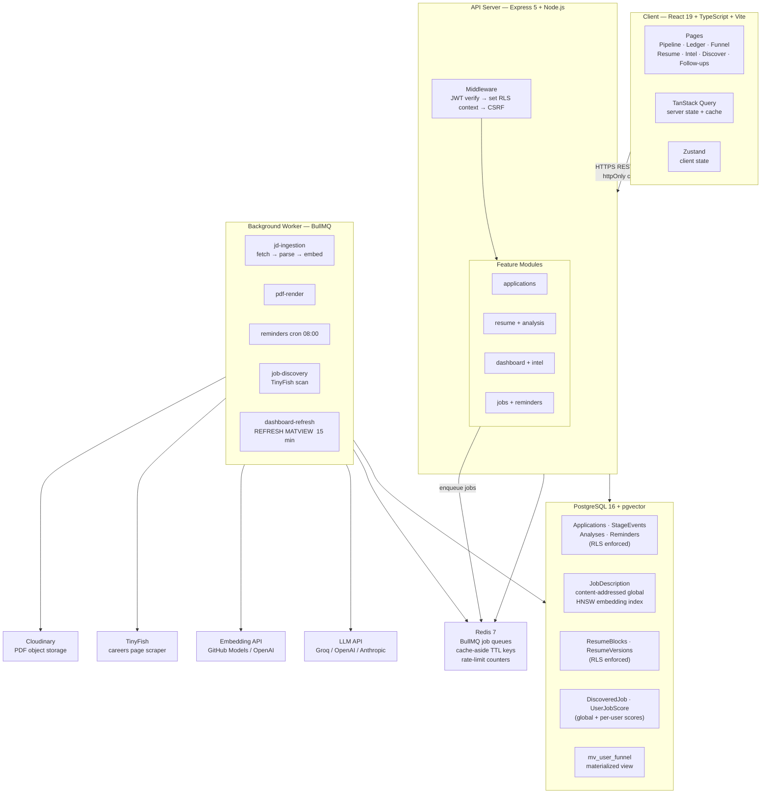
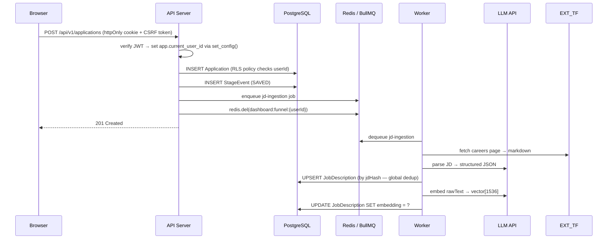
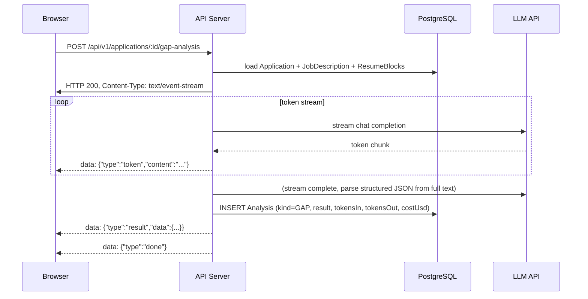
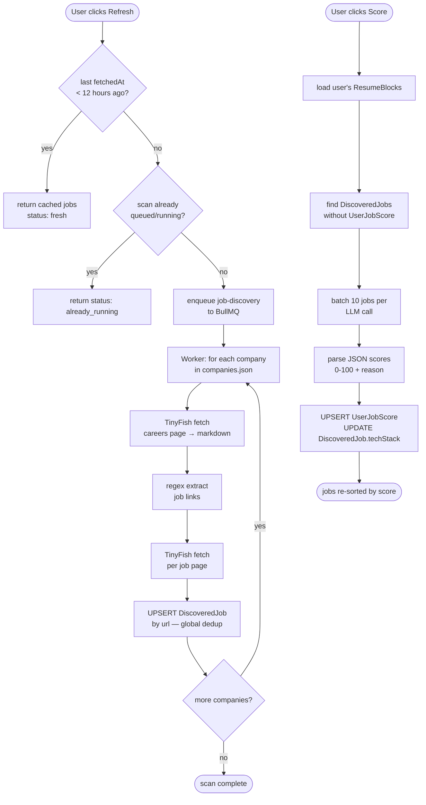
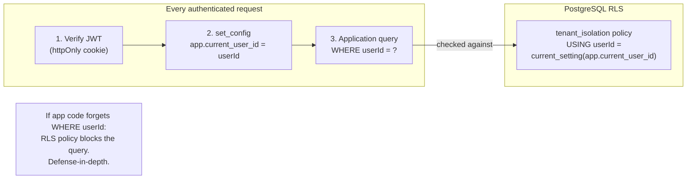
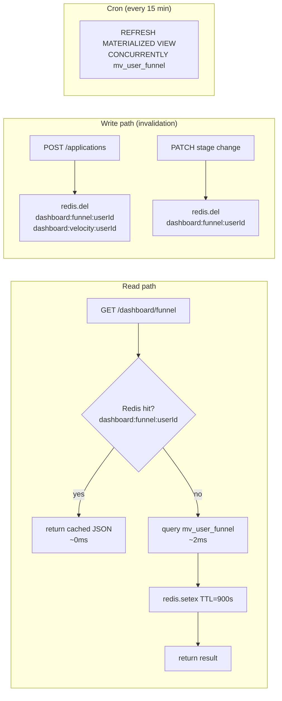
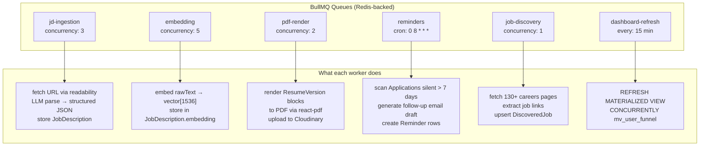

# Architecture

---

## System Overview

---

## Request Lifecycle

---

## LLM Analysis Flow (SSE Streaming)

---

## Job Discovery Flow

---

## Multi-Tenancy Model

**Shared vs global tables:**

| Table | Scoped to | RLS |
|-------|-----------|-----|
| Application, ResumeBlock, etc. | Per user | Enabled |
| StageEvent, Analysis, Reminder | Via Application join | Enabled |
| JobDescription | Global (content-addressed) | None |
| DiscoveredJob | Global (shared scrape) | None |
| UserJobScore | Per user | Enabled |

---

## Caching Strategy

| Cache key | TTL | Invalidated on |
|-----------|-----|----------------|
| `dashboard:funnel:{userId}` | 15 min | application create / stage change |
| `dashboard:velocity:{userId}` | 15 min | application create |
| `intel:skill-demand:{userId}` | 1 hour | — (TTL only) |
| `intel:clusters:{userId}` | 5 min | — (TTL only) |

---

## Background Worker Queues

---

## Key Design Decisions

| Decision | Choice | Alternative considered |
|----------|--------|----------------------|
| Service shape | Modular monolith, two processes (API + worker) | Microservices: no benefit at this scale, large ops overhead |
| Multi-tenancy | Shared schema + PostgreSQL RLS | Schema-per-tenant: 10× migration complexity; DB-per-tenant: cost-prohibitive |
| JD storage | Global content-addressed by jdHash | Per-user: duplicates LLM parse and embedding for shared jobs |
| FTS | Generated tsvector column + GIN index | Query-time `to_tsvector()`: O(n) full scan, no index |
| ANN search | HNSW | IVFFlat: requires upfront clustering, poor for dynamic inserts |
| Background jobs | BullMQ + Redis | In-process cron: no retries or observability; SQS/Lambda: cloud lock-in |
| LLM streaming | SSE | WebSockets: bidirectional not needed; SSE is simpler and proxy-friendly |
| Auth | JWT in httpOnly cookie + rotating refresh | localStorage: XSS-exposed; server sessions: fine but JWT handles stateless scaling |
| Soft deletes | `deletedAt` timestamp | Hard delete: no undo, no GDPR audit trail |
| Dashboard aggregation | Materialized view + Redis cache | Raw query on every request: O(rows) per page load |
