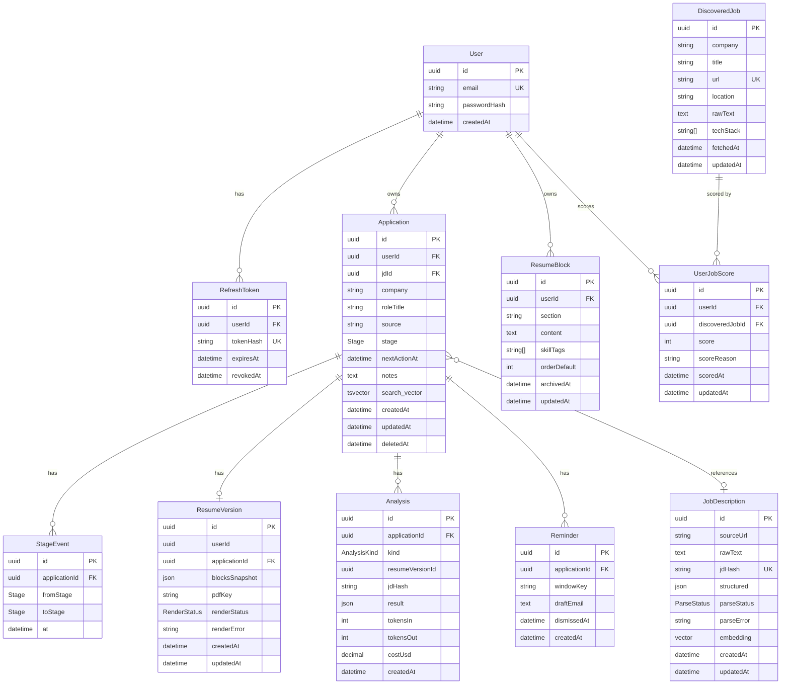

# Database Schema

Pursuit uses PostgreSQL 16 with the pgvector extension. The schema is designed for shared-schema multi-tenancy with Row Level Security enforced at the database layer.

---

## Entity Relationship Diagram



---

## Models

### `User`
Root of the tenant hierarchy. Every user-scoped table traces back to this via `userId`.

### `RefreshToken`
Stores hashed refresh tokens for the rotating-token auth flow. `revokedAt` enables explicit logout. Index on `(userId, expiresAt)` covers both token revocation and expiry cleanup.

### `Application`
Central model. Tracks one job application from SAVED through OFFER/REJECTED/GHOSTED.

- `search_vector` — STORED generated column: `to_tsvector('english', company || roleTitle || notes)`. Maintained by PostgreSQL on every write. GIN index makes FTS O(log n).
- `deletedAt` — soft delete. All queries filter `WHERE deletedAt IS NULL`. Enables undo and GDPR export-then-delete.
- `stage` — denormalized current stage for O(1) reads. Full history lives in `StageEvent`.

### `StageEvent`
Append-only audit log of every stage transition. Never updated, never deleted. The dashboard median-days-in-stage calculation scans this table; index on `(applicationId, at)` covers both the filter and the sort.

### `JobDescription`
**Global, content-addressed. No `userId`.** The `jdHash` (SHA-256 of normalized raw text) is the globally unique key. Two users applying to the same job share one row, one LLM parse call, and one embedding computation.

- `structured` — parsed JSON: title, company, skills, YOE range, salary, responsibilities.
- `embedding` — 1536-dim vector (text-embedding-3-small). HNSW index for O(log n) approximate nearest-neighbor search.
- `parseStatus` — FSM: `QUEUED → FETCHING → PARSING → DONE | FAILED`. Partial index on `(parseStatus) WHERE parseStatus IN ('QUEUED', 'FETCHING')` is near-zero size in steady state.

### `ResumeBlock`
A single block of resume content (Experience, Projects, Skills, Education). Content stored as JSON string in the `content` field — structured on the client, serialized for storage. `skillTags` is a flat `text[]` for fast skill matching without JSON parsing.

### `ResumeVersion`
Immutable snapshot of selected resume blocks at the point of tailoring, linked to one Application. `blocksSnapshot` captures the exact block content used — protects against future edits changing historical versions.

- `renderStatus` — enum `PENDING | DONE | FAILED`. Replaces the null-check antipattern (`pdfKey IS NULL` is ambiguous: pending or failed?).

### `Analysis`
Stores LLM analysis results. `kind` discriminates the three types:

| Kind | What `result` contains |
|------|----------------------|
| `GAP` | `matchedSkills`, `missingSkills`, `partialSkills`, `bulletRanking`, `llmRelevanceScore`, `matchScore`, `overallSummary` |
| `PREP` | `technicalQuestions`, `behavioralQuestions`, `gapProbes`, `companyAngle` |
| `TAILOR` | `proposals[]` — per-block `include/exclude/rewrite` with `rewrittenContent` |

`costUsd` tracks per-analysis spend for the LLM cost dashboard.

### `Reminder`
A follow-up nudge generated when an application has been silent for N days. `windowKey` prevents duplicate reminders for the same silence window per application (`@@unique([applicationId, windowKey])`). Partial index on `applicationId WHERE dismissedAt IS NULL` keeps the active-reminders query fast; dismissed rows are never queried again.

### `DiscoveredJob`
**Global shared content. No `userId`, no RLS.** Careers page listings scraped by the discovery worker from 130+ companies via TinyFish. One scan serves all users.

- `techStack` — extracted during per-user LLM scoring and stored here (it's a property of the job, not the user).
- `url` — globally unique. Upsert-on-conflict deduplicates across scan runs.

### `UserJobScore`
Per-user relevance scores for discovered jobs. The scoring function is `(resume_blocks, job_raw_text) → score + reason`. `@@unique([userId, discoveredJobId])` enforces one score per user per job; upsert updates the score on re-score.

---

## Enums

```
Stage:        SAVED | APPLIED | OA | TECH | HR | OFFER | REJECTED | GHOSTED
ParseStatus:  QUEUED | FETCHING | PARSING | DONE | FAILED
AnalysisKind: GAP | PREP | TAILOR
RenderStatus: PENDING | DONE | FAILED
```

